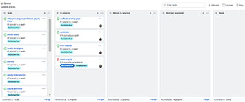

# Landing Page | Garotas Enxaqueca

## Tabela de conteúdos

 <a href="#Descrição do Projeto">Descrição do Projeto</a> •
 <a href="#roadmap">Roadmap</a> • 
 <a href="#Features">Features</a> • 
 <a href="#Status do Projeto">Status do Projeto</a> • 
 <a href="#Para contribuir com o projeto">SPara contribuir com o projeto</a> • 

## Descrição do Projeto

 Projeto incial para criação de uma landing page

## Roadmap

## Features

- [ ] Cadastro de e-mail para contato
- [ ] Redirecionamento para outros canais
- [ ] Sessão redes sociais 
- [ ] Sessão sobre 
- [ ] Contato
- [ ] 🚧 🚀 Em construção...  🚧

## Status do Projeto
<h4> 
	🚧🚀 Em construção...  🚧
</h4>

## Para contribuir com o projeto

- feat (feature)
- fix (bug fix)
- docs (documentation)
- style (formatting, missing semi colons, …)
- refactor
- test (when adding missing tests)
- chore (maintain)

*leia mais sobre o padrão em: (https://gist.github.com/stephenparish/9941e89d80e2bc58a153)*